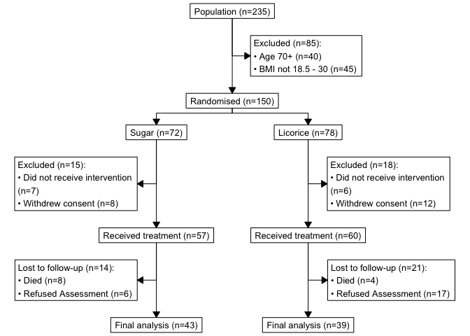

# Licorice trial consort diagram

# The Licorice Gargle Dataset

These are data from a study by Ruetzler et al. ‘A Randomized,
Double-Blind Comparison of Licorice Versus Sugar-Water Gargle for
Prevention of Postoperative Sore Throat and Postextubation Coughing’.
Anesth Analg 2013; 117: 614 – 21.

Postoperative sore throat is a common and annoying complication of
endotracheal intubation. This study tested the hypothesis that gargling
with licorice solution immediately before induction of anesthesia
prevents sore throat and postextubation coughing in patients intubated
with double-lumen tubes.

# Data cleaning

Data dictionary:
https://higgi13425.github.io/medicaldata/reference/licorice_gargle.html

The publicly available dataset only includes final
analysis-ready/complete patients. To demonstrate the making of a consort
diagram we’ve randomly created three new variables of exclusions:

- eligibility
  - age \> 70 years
  - BMI outwith 18.5 - 30
- intervention
  - did not receive intervention
  - withdrew consent
- lost to follow up
  - died
  - refused assessment

``` r
library(tidyverse)
library(consort)
library(medicaldata)

licodata = medicaldata::licorice_gargle %>% 
  rowid_to_column("patient_id") %>% 
  # make treatment var from 0,1 to factor
  mutate(randomisation = treat %>% 
           factor() %>% 
           fct_recode("Sugar"    = "0",
                      "Licorice" = "1")) %>% 
  # assess eligigibility
  mutate(eligibility = case_when(preOp_age > 70 ~ "Age 70+",
                                 ! between(preOp_calcBMI, 18.5, 30) ~ "BMI not 18.5 - 30",
                                 .default = NA),
         # randomly generate intervention failed and lost to follow up variables
         intervention = sample(c("Did not receive intervention", "Withdrew consent",NA),
                               size = 235,
                               replace = TRUE,
                               prob = c(0.1, 0.1, 0.9)),
         followup = sample(c("Died", "Refused Assessment", NA),
                           size = 235,
                           replace = TRUE,
                           prob = c(0.1, 0.2, 0.7))) %>% 
  mutate(randomisation = if_else(is.na(eligibility), randomisation, NA)) %>% 
  mutate(intervention = if_else(is.na(eligibility), intervention, NA)) %>% 
  mutate(followup = if_else(is.na(intervention), followup, NA))
```

# CONSORT (Consolidated Standards of Reporting Trials) diagram

``` r
p_cons = consort_plot(licodata,
             order = list(patient_id    = "Population",
                          eligibility   = "Excluded",
                          randomisation = "Randomised",
                          intervention  = "Excluded",
                          patient_id    = "Received treatment",
                          followup      = "Lost to follow-up",
                          patient_id    = "Final analysis"),
             side_box = c("eligibility", "intervention", "followup"),
             allocation = "randomisation",
             cex = 0.8,
             text_width = 30)

p_cons
```



## Exporting

``` r
plot(p_cons, grViz = TRUE) |> 
  DiagrammeRsvg::export_svg() |> 
  charToRaw() |> 
  rsvg::rsvg_pdf("consort_diagram.pdf")
```
