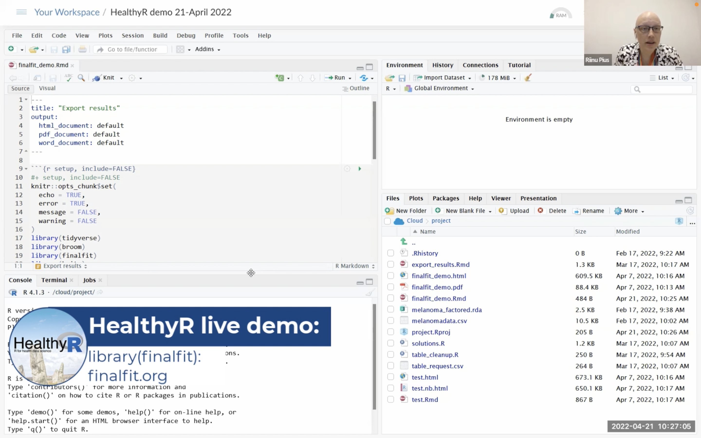

# HealthyR live demos

More information on the HealthyR: R for Health Data Science courses and free resources can be found at https://healthyr.surgicalinformatics.org/

## library(finalfit) - quickly create elegant final results tables and plots when modelling in R

Dataset here: TODO add
Code here: TODO add

  
Recorded in April 2022.

