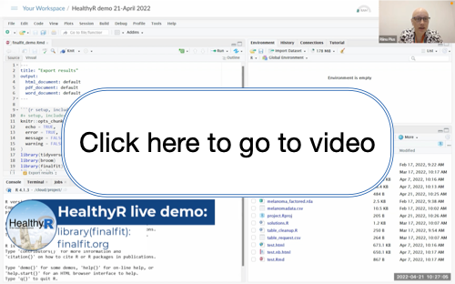
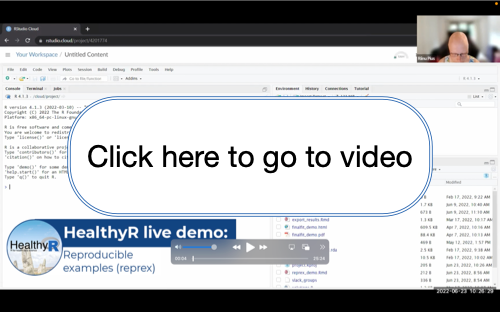

# Live R demos

More information on the HealthyR: R for Health Data Science courses, upcoming live demos, clinics, and free resources can be found at https://healthyr.surgicalinformatics.org/

*Internal note: the demo bank lives in healthyr_admin.*

## library(finalfit) - quickly create elegant final results tables and plots

This video covers:
* demographics table
* variable labels
* odds ratio plots

[melanoma dataset and R Markdown document (2022-04 folder in this repository)](2022-04)

  

Presented by Riinu Pius and Ewen Harrison, recorded in April 2022.

## bar plots - geom_bar() or geom_col()?

This video covers:
* How to approach a brand new dataset: viewing data, variable names, and counts
* Plotting uncounted, case-level data with geom_bar()
* Summarising data and then plotting aggregated data with geom_col()
* Reordering factors in geom_col()

[R Script, including dataset loading (2022-05 folder in this repository)](2022-05)

%20vs%20geom_col()/1_49w03lqk)  

Presented by Riinu Pius and Ewen Harrison, recorded in May 2022.

## Reproducible example - reprex

This video covers:
* Generating dummy/example datasets with tibble()
* Reproducing real dataset issues in an example dataset
* Sharing minimal reproducible examples

[R Markdown document including dataset loading (2022-06 folder in this repository)](2022-06)

/1_zo8af9bg)  

Presented by Riinu Pius and Mathew Thorpe, Recorded in June 2022.

## Create a global map

This video covers:
* Exploring a brand new dataset
* Creating a global map, customised based on your data
* Troubleshooting issues based on mismatched countries

[R Script including dataset loading (2022-08 folder in this repository)](2022-08)

  

Presented by Riinu Pius and Ewen Harrison, Recorded in August 2022. 

## Reshape Data

This video covers:
* Prepare your data in a format suitable for analysis 
* Pivot longer and Pivot wider

[R Script including dataset loading (2022-08 folder in this repository)](2022-08)

/1_wmix0222)

Presented by Riinu Pius, Ewen Harrison and Sarah Elliot, Recorded in August 2022. 

## Plot Improvements

This video covers:
* Exploring a new data set 
* How to create plots using ggplot()
* Edit plot to create high quality visualisations 

[R Script including dataset loading (2022-09 folder in this repository)](2022-09)

Presented by Ewen Harrison and Sarah Elliot, Recorded in September 2022. 

## Stringr

This video covers:
* Using stringr
* Free text manipulation
* Regular Expressions

[R Script including dataset loading (2022-10 folder in this repository)](2022-10)

Presented by Ewen Harrison and Sarah Elliot, Recorded in October 2022. 

## Joining datasets 

This video covers:
* *_join() from the tidyverse
* Mutational joins, such as left, right, inner, full
* Anti_join() and semi_join()

[R Script including dataset loading (2022-11 folder in this repository)](2022-11)

Presented by Ewen Harrison and Sarah Elliot, Recorded in November 2022. 

## Table One - finalfit

This video covers:
* Explore a new dataset
* Create a summary table with variables of interest to investigate confounding 
* Edit this output to create a publishable table 

[R Script including dataset loading (2023-03 folder in this repository)](2023-03)

Presented by Ewen Harrison and Sarah Elliot, Recorded in March 2023. 

## Cleaning Data 

This video covers:
* Formatting variables in R
* Working with dates
* Out of range values - summarising, visuals, plotly
* Filter or remove variables

[R Script including dataset loading (2023-08 folder in this repository)](2023-08)  

Presented by Ewen Harrison, Riinu Pius and Sarah Elliot, Recorded in August 2023.

## Automatic Parameterised Reports 

This video covers:
* Producing multiple PDFs automatically
* Utilising 'Knit with parameters' within the Posit interface
* Purrr for iteration - using map() and pwalk()

[R Script including dataset loading (2023-08 folder in this repository)](2023-08)  

Presented by Riinu Pius and Sarah Elliot, Recorded in August 2023.

## Data Cleaning 2

This video covers:
* Cleaning column names
* Consistency of NAs
* Duplicate entries

[R Script including dataset loading (2023-10 folder in this repository)](2023-10)  

Presented by Riinu Pius and Sarah Elliot, Recorded in October 2023.

## Reading Multiple Spreadsheets

This video covers:
* Reading in CSV and XML files into R
* Working with multiple sheets in one file
* The difference between binding rows and joining dataframes

[R Script including dataset loading (2023-10 folder in this repository)](2023-10)  

Presented by Riinu Pius and Sarah Elliot, Recorded in October 2023.

## Quarto 1

This video covers:
* What is Quarto?
* Quarto Projects and Documents
* Executable Options
* COnditional Content

[R Script including dataset loading (2023-11 folder in this repository)](2023-11)  

Presented by Riinu Pius and Sarah Elliot, Recorded in November 2023.

## Quarto 2

This video covers:
* Creating a website
* Publishing a website 
* Quarto tips 

[R Script including dataset loading (2023-11 folder in this repository)](2023-11)  

Presented by Riinu Pius and Sarah Elliot, Recorded in November 2023.

## Venn Diagrams and Upset Plot

This video covers:
* Venn diagrams 
* Upset plots
* Editing diagrams

[R Script including dataset loading (2023-11 folder in this repository)](2024-02)  

Presented by Neil Clark and Sarah Elliot, Recorded in February 2024.

## Consort/Flow diagrams

This video covers:
* Data cleaning
* Consort diagrams with library(consort)
* PDFs and word documents

[R Script including dataset loading (2023-11 folder in this repository)](2024-02)  

Presented by Riinu Pius and Sarah Elliot, Recorded in February 2024.

