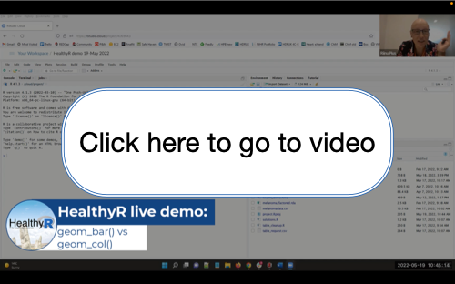

# Live R demos

More information on the HealthyR: R for Health Data Science courses, upcoming live demos, clinics, and free resources can be found at https://healthyr.surgicalinformatics.org/

*Internal note: the demo bank lives in healthyr_admin.*

## library(finalfit) - quickly create elegant final results tables and plots

This video covers:
* demographics table
* variable labels
* odds ratio plots

[melanoma dataset and R Markdown document (2022-04 folder in this repository)](2022-04)

  
Presented by Riinu Pius and Ewen Harrison, recorded in April 2022.

## bar plots - geom_bar() or geom_col()?

This video covers:
* How to approach a brand new dataset: viewing data, variable names, and counts
* Plotting uncounted, case-level data with geom_bar()
* Summarising data and then plotting aggregated data with geom_col()
* Reordering factors in geom_col()

[R Script, including dataset loading (2022-05 folder in this repository)](2022-05)

%20vs%20geom_col()/1_49w03lqk)  
Presented by Riinu Pius and Ewen Harrison, recorded in May 2022.

## Reproducible example - reprex

This video covers:
* Generating dummy/example datasets with tibble()
* Reproducing real dataset issues in an example dataset
* Sharing minimal reproducible examples

[R Markdown document including dataset loading (2022-06 folder in this repository)](2022-06)

/1_zo8af9bg)  
Presented by Riinu Pius and Mathew Thorpe, Recorded in June 2022.

## Create a global map

This video covers:
* Exploring a brand new dataset
* Creating a global map, customised based on your data
* Troubleshooting issues based on mismatched countries

[R Script including dataset loading (2022-08 folder in this repository)](2022-08)

  
Presented by Riinu Pius and Ewen Harrison, Recorded in August 2022.

